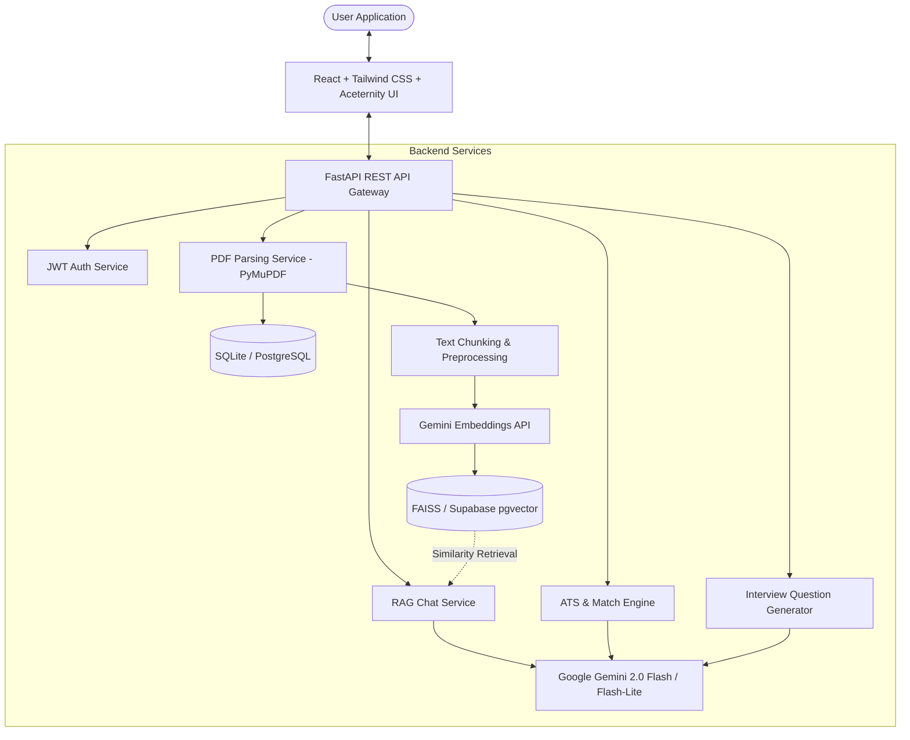

# ResumeIQ — AI Resume & Job Intelligence

A full-stack, production-grade AI-powered career platform that leverages **FastAPI**, **React**, **Google Gemini**, **FAISS / Supabase pgvector**, and **Tailwind CSS with Aceternity UI** to deliver real-time ATS compatibility scoring, resume–job description matching, skill gap discovery, RAG conversational assistance, and personalized interview preparation.

*Powered by Romsha Wadhwa*

---

## 🌟 Key Features

- **Resume Intelligence & Parsing**: High-fidelity PDF document parsing powered by PyMuPDF and Google Gemini to extract contact information, executive summaries, categorized skill inventories, employment histories, and educational credentials.
- **ATS Compatibility Scoring**: Multi-factor ATS scoring engine evaluating skill coverage, keyword density, experience relevance, education match, formatting stability, and project depth with clear 0–100% metrics.
- **Resume vs Job Description Match Report**: Semantic vector alignment benchmarking candidate resumes against target job postings to identify matched qualifications, missing technologies, and actionable improvements.
- **RAG-Powered AI Career Assistant**: Ground-truth conversational interface utilizing Retrieval-Augmented Generation (RAG) with FAISS vector indexing and Google Gemini to query your resume and target job role with contextual citations.
- **Tailored Interview Preparation**: Synthesizes custom interview question sets categorized into HR & Behavioral, Technical Proficiency, Resume Deep-Dive, and Project Execution with STAR response guidance.
- **Modern SaaS Dashboard & Global Animated Background**: Complete frontend experience powered by Aceternity UI animated gradient mesh background, custom theme toggle (Light / Dark mode), responsive mobile navigation, and defensive data safety.
- **JWT Authentication & Security**: Secure token-based authentication protecting all user workspaces, resumes, and analysis reports.

---

## 🏗️ Architecture



---

## 💻 Tech Stack

### Frontend
- **Framework**: React 18, Vite
- **Routing**: React Router v7
- **Styling**: Tailwind CSS v3, PostCSS, Custom CSS Variables
- **Animations**: Aceternity UI `BackgroundGradientAnimation`
- **Theme**: Dark & Light Mode with localStorage persistence
- **HTTP Client**: Axios with JWT interceptors

### Backend
- **Framework**: FastAPI (Python 3.11+)
- **LLM & Embeddings**: Google Gemini API (`gemini-2.0-flash-lite`, `embedding-001`)
- **Vector Search / RAG**: FAISS & Supabase pgvector
- **PDF Extraction**: PyMuPDF (fitz)
- **Database / ORM**: SQLite / PostgreSQL via SQLAlchemy + aiosqlite
- **Security**: OAuth2 with Password Hashing (bcrypt) & PyJWT

---

## 🚀 Getting Started

### Prerequisites
- **Python**: 3.11+
- **Node.js**: 20+ (with npm)
- **Google Gemini API Key**: [Get your key from Google AI Studio](https://aistudio.google.com/app/apikey)

---

### 1. Repository Setup

```bash
git clone https://github.com/Romsha23/AI-Resume-Analyzer-RAG.git
cd AI-Resume-Analyzer-RAG
```

---

### 2. Backend Setup

```bash
cd backend

# Create and activate virtual environment
python -m venv venv

# On Windows:
.\venv\Scripts\activate
# On macOS / Linux:
source venv/bin/activate

# Install dependencies
pip install -r requirements.txt

# Configure environment variables
cp .env.example .env
# Edit .env and supply your GEMINI_API_KEY and a secure SECRET_KEY

# Start backend server
uvicorn app.main:app --reload --host 0.0.0.0 --port 8000
```

Backend API documentation and interactive Swagger UI will be available at:
`http://localhost:8000/docs`

---

### 3. Frontend Setup

```bash
cd ../frontend

# Install dependencies
npm install

# Configure environment variables
cp .env.example .env

# Start frontend development server
npm run dev
```

The application will be live at:
`http://localhost:5173`

---

## ⚙️ Environment Variables

### Backend (`backend/.env`)
```env
APP_NAME="ResumeIQ"
APP_ENV=development
SECRET_KEY=your_random_secret_key_here
ALGORITHM=HS256
ACCESS_TOKEN_EXPIRE_MINUTES=1440

DATABASE_URL=sqlite+aiosqlite:///./resume_analyzer.db

# Google Gemini API
GEMINI_API_KEY=your_gemini_api_key_here
GEMINI_MODEL=gemini-2.0-flash-lite
EMBEDDING_MODEL=models/embedding-001

# CORS settings
CORS_ORIGINS=http://localhost:5173;http://localhost:3000

# File uploads
UPLOAD_DIR=uploads
```

### Frontend (`frontend/.env`)
```env
VITE_API_URL=http://localhost:8000/api
```

---

## 📡 API Reference

| Method | Endpoint | Description |
|---|---|---|
| `POST` | `/api/auth/register` | Register a new user account |
| `POST` | `/api/auth/login` | Authenticate and obtain JWT token |
| `GET` | `/api/auth/me` | Fetch currently authenticated user profile |
| `POST` | `/api/resume/upload` | Upload and parse candidate PDF resume |
| `GET` | `/api/resume/list` | List all uploaded resumes for user |
| `POST` | `/api/jd/text` | Save job description from raw text |
| `POST` | `/api/jd/upload` | Upload and parse job description PDF |
| `GET` | `/api/jd/list` | List all saved job descriptions |
| `POST` | `/api/analyze/ats-score` | Calculate multi-metric ATS score |
| `POST` | `/api/analyze/match` | Perform semantic Resume vs JD comparison |
| `POST` | `/api/chat/query` | Query RAG assistant with context retrieval |
| `POST` | `/api/generate/interview-questions` | Generate role-specific interview questions |
| `GET` | `/api/dashboard/stats` | Retrieve workspace overview metrics |

---

## 🔒 Security Best Practices

- Real credentials (`.env`), API keys, local databases (`*.db`, `*.sqlite`), and generated upload files are excluded via `.gitignore`.
- Authentication tokens use stateless JWTs stored securely on the client.
- Sensitive files and secrets are never committed to version control.

---

## 📄 License

This project is licensed under the MIT License.
